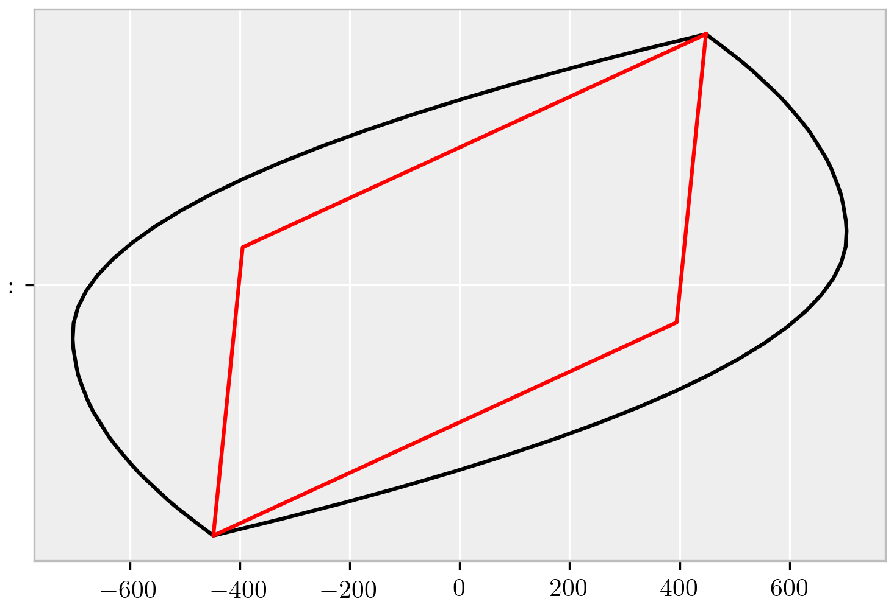

---
jupyter:
  kernelspec:
    display_name: Python 3
    language: python
    name: python3
  language_info:
    codemirror_mode:
      name: ipython
      version: 3
    file_extension: .py
    mimetype: 'text/x-python'
    name: python
    nbconvert_exporter: python
    pygments_lexer: ipython3
    version: 3.8.2
  nbformat: 4
  nbformat_minor: 4
title: 'T-Section Limit Surface'
---

# T-Section Limit Surface

``` {.python}
from elle.sections import plot_surface_T
```

``` {.python}
## OPTIONAL PLOT STYLING
import matplotlib.pyplot as plt
plt.style.use('trois-pas')
```

### Material rule

``` {.python}
fy = 1
E = 1
epsy = fy/E
```

### Section Properties

``` {.python}
section_data = {
    'bf': 16.,
    'd' : 16.,
    'tw': 8.0,
    'fy': fy,
    'E' :  E,
    'quad':[{'n':25,'rule':'mid'}, {'n':10,'rule':'mid'}, {'n':10,'rule':'mid'}] }
```

``` {.python}
plastic_surface, yield_surface = plot_surface_T(yref=4.,ymf=6.,**section_data)
```

    /home/claudio/miniconda3/envs/piplin/lib/python3.8/site-packages/jax/lib/xla_bridge.py:116: UserWarning: No GPU/TPU found, falling back to CPU.
      warnings.warn('No GPU/TPU found, falling back to CPU.')

{style="margin:auto; display: block; max-width: 75%"}

``` {.python}
plastic_surface.get_figure().savefig('../main.png')
```
